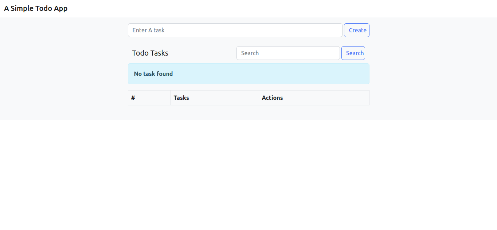
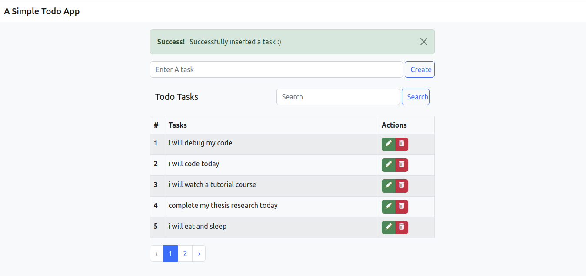
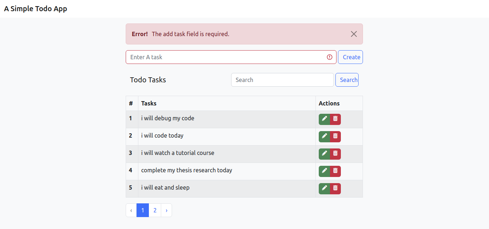

## A Simple TODO-APP
This project provides a basic introduction to the Laravel framework and includes content on the following concepts:
- Basic CRUD system with Eloquent ORM approach, 
- Views using Blade templates engine.
- Controller and models,
- Input validation,
- Database migrations
- View route, post route and get route
- Pagination and 
- CSRF Protection
- Proccessing of request using ajax call

## Quick Installation
First, clone repo and install all dependencies.
```sh
$ git clone https://github.com/Godstyme/todo-app.git
$ cd todo-app
$ composer install
```
Setup database by creating a database called `todo_app` in your `phpMyAdmin`. This example uses the `todo_app` database as configured in the app `.env` file.
We have to use a migration command to prepare the database migration classes for the target tables.

```sh
$ php artisan make:model Task --migration
$ php artisan serve
``` 

You're ready to go! :)
##
Index Page with empty table              |  Index  Page with content |  Index page with error display message
:-------------------------:|:-------------------------:|:-------------------------:
  |   | 

## About Laravel
Laravel is a web application framework with expressive, elegant syntax. We believe development must be an enjoyable and creative experience to be truly fulfilling. Laravel takes the pain out of development by easing common tasks used in many web projects. Check it out in 
- https://laravel.com/

